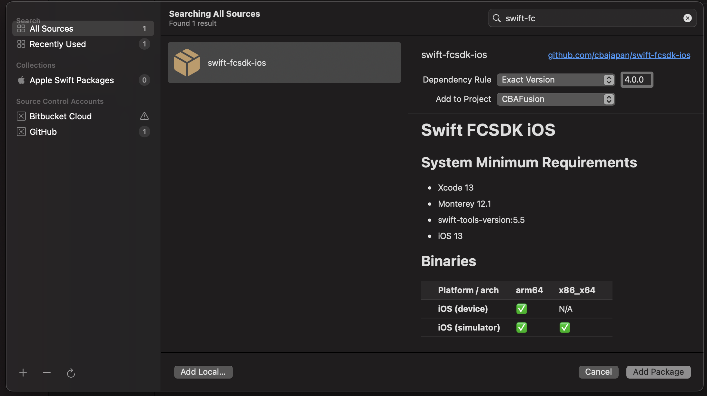
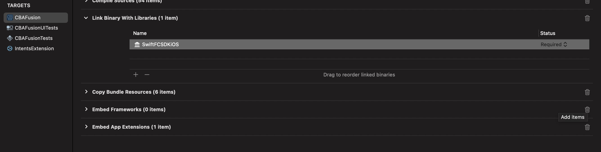
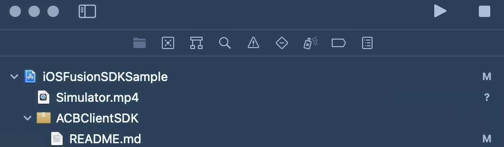
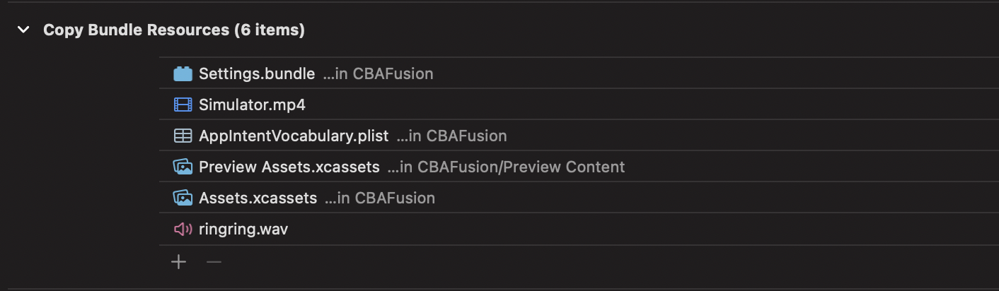
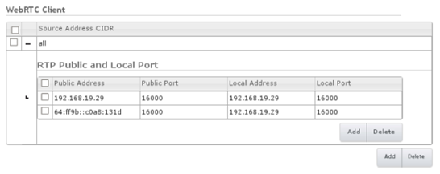

# FCSDK Extras

This Article discusses all of the extra important details of FCSDK not covered in other articles

## Threading

- We have created a new threading model built from tools by Apple. This threading model makes the best use of the voice and video concurrency flow. With that being said, whenever you are interacting with the UI in your application while interacting with the call flow, you will need to make sure you are running your code on the main thread. For example when we make a call using FCSDKiOS in the sample app, we are interacting with our apps UI during the call flow, therefore we need to make those calls on the main thread. You can run code on the main thread like so.

```swift
func startCall() async throws {
// Run on the main thread
    await MainActor.run {
        self.hasStartedConnecting = true
    }
}
```

- We also have async versions of methods you may decided to use. If you choose to await on a method your call to that method must be wrapped in a **Task** or the call must be **async**. If you write an async method any FCSDK calls you use will automatically detect that they should use the async version of that call. If you want to side step this logic simply use a Task to wrap the async call instead of writing an async method. For example...

```swift
    func someMethod() async {
// Valid
    await uc.startSession()

// Invalid, Swift Concurreny will force the await version
    startSession()
}
```

or

```swift
    func someMethod() {
// Valid
Task {
        await startSession()
}
// Valid
        startSession()
    }
```


## SPM
To set up a project using the Swift Package we want to depend on the Swift Package at the root level of your project. 

-   Open your Xcode project, navigate to the project, and then into Package Dependencies. Click the + button and add the pacakge like so.



-   We want to make sure that the binary has been linked to the project. Click the **General** tab of your Target, and expand the _Frameworks, Libraries, and Embedded Content_ section by clicking on the title.
-   If the Binary is not embedded then click the **+** button; the file explorer displays.
-   Select the SwiftFCSDKiOS Library and press add



-   Done, your project is now ready to use Fusion Client SDK

## Bitcode Support
Bitcode can be enabled in the Build Settings
```
    Enable Bitcode = YES
```
## Simulator Support
We now offer simulator support with FCSDKiOS. It is simple to set up. The Simulator does not support the use of the camera, therefore we need to give it a video to stream to your real device.

- Create a short placeholder video (about 5 seconds long) and name it `Simulator.mp4`.

- Drag and Drop the `.mp4` into the root level of your application like the picture shows bellow.



- Make sure you select `copy items if needed` and select the `target` you wish to add the video to, like the picture shows below.


- You will also want to add it to your Copy Bundle Resources in the apps target Build Phase.



It is now set up. Now when you make calls with the simulator, you will see the video from your real device and the mp4 will stream from the simulator. 

## Using FCSDK Swift Package in a Framework or Static Library

**If you are interested in building a Static Library instead of a Framework the process is the same**

FCSDKiOS consists of 2 Frameworks
1. FCSDKiOS
3. CBARealTime

The nature of Frameworks and Static Libraries cause us to use them in a very specific way. Apple will not allow Embedded Frameworks to be released on the App Store in iOS. So that means if you try and embed these 2 frameworks into your framework, it will inevitably fail. What you want to do when it comes to depending on a framework within your framework is to link the child framework to the parent framework, but **DO NOT EMBED THEM**. This will result in the External Symbols being linked, but not the internal symbols. So, if you try to place the framework you created in your application, you will get several errors saying that there are symbols missing. How can this be resolved? You need to import those same 2 frameworks you depend on in your framework into the Application you are building. 

This seems like a lot of work, so we have done most of it for you with our Swift Package.

All you need to do is import the Swift Package into your framework as described above. However, what you will need to do in order to use the Framework you are developing in an iOS application has a couple of steps you will need to follow.

We basically have 2 options. 
1. Do as described above and import your framework that depends on FCSDKiOS along with FCSDKiOS into the iOS application. 
OR
2. Let Swift Package Manager handle all of that for you.

**We will describe option 2, as it is our recommendation.**

You will want to create a Swift Package in order to distribute your XCFramework.

1. Open Terminal
2. Create a directory - you can name it something like `my-framework-kit` with `mkdir MY_DIRECTORY`
2. Move into that directory with `cd my-framework-kit`
3. Create the Swift Package with `swift package init`
4. Open `Package.swift` in Xcode
5. Make sure that your XCFramework is in the root directory of the Swift Package, so in our case, it should be located in `my-framework-kit`

**Now, with you Package.swift open make sure it looks like this**
```swift
// swift-tools-version:5.5
// The swift-tools-version declares the minimum version of Swift required to build this package.

import PackageDescription

let package = Package(
    name: "my-framework-kit",
    products: [
        .library(
            name: "my-framework-kit",
            type: .static,
            targets: ["my-framework-kit"]),
    ],
    dependencies: [
        .package(name: "FCSDKiOS", url: "https://github.com/cbajapan/FCSDKiOS.git", .exact("4.0.0"))
    ],
    targets: [
        .target(
            name: "my-framework-kit",
            dependencies: [
                "my-framework",
                .product(name: "FCSDKiOS", package: "FCSDKiOS")
            ]),
        .binaryTarget(name: "my-framework", path: "my-framework.xcframework")
    ]
)
```
I will describe what this file does - What we are mostly interested in is the **Package**

Inside this initializer, we have 4 properties
1. Name
2. Products
3. Dependencies
4. Target

* Name is not super important to us, but typically this is the name of the directory you made
* Products consists of the Libraries name; we also need to specify this Library as a Static Library, and we want to tell it about our Target that we define in **Packages** final property.
* Dependencies are any code that you want to bring in from a url that is an internal or external resource, so basically, other Swift Packages. Here we are depending on `FCSDKiOS`
* Finally, our Targets involves the target we want our package to know about and its dependencies. So here we are depending on our `my-framework.xcframework` binary locally, and then we need to tell the target about the package dependency we fetch from *Github*. We also need to tell our target where our **XCFramework** is located in the `binaryTarget`


Once we create our Swift Package, as describe above, we have 2 options.

1. Depend on it Locally by dragging the Swift Package into the project and make sure the Binary is linked in the target.
2. Commit our Swift Package to a git repo and have our iOS client fetch it from there.
We can fetch remote code from our iOS Project by doing the following:
```
1. In your Xcode Project, select File > Swift Packages > Add Package Dependency
2. Follow the prompts using the URL for this repository
3. Choose which version you would like to checkout (i.e. 4.0.0)
```


## Creating an XCFramework

In order to create an XCFramework that supports a variety of Archetectures we recommend using a shell script to Archive your project's target and then create the XCFramework. So in the root of your Framework or Static Library Create a file and call it something like `build.sh` 

Here is an example of what `build.sh` need to have inside of it

### Note
You need to make sure that in your project in the Xcode Build Settings these 2 settings are set accordingly
```
SKIP_INSTALL=NO
```
```
BUILD_LIBRARY_FOR_DISTRIBUTION=YES
```

```
#!/bin/zsh

xcodebuild archive \
-project YourProject.xcodeproj \
-scheme YourProjectTarget \
-archivePath target/xcodebuild/device.xcarchive \
-destination "generic/platform=iOS" \
SKIP_INSTALL=NO \
BUILD_LIBRARY_FOR_DISTRIBUTION=YES \
ARCHS="arm64" \
IPHONEOS_DEPLOYMENT_TARGET=12.0 \
# If you want to enable bitcode these are the lines you need
ENABLE_BITCODE=YES \

# Simulator builds don't have bitcode abilities
xcodebuild archive \
-project YourProject.xcodeproj \
-scheme YourProject \
-archivePath build/simulator.xcarchive \
-destination "generic/platform=iOS Simulator" \
SKIP_INSTALL=NO \
ARCHS="arm64" \
BUILD_LIBRARY_FOR_DISTRIBUTION=YES \
IPHONEOS_DEPLOYMENT_TARGET=12.0 

#Time to create an XCFramework with device and simulator for a Static Library
xcodebuild -create-xcframework \
-library build/device.xcarchive/Products/usr/local/lib/libYourFramework.a \
-headers build/device.xcarchive/Products/usr/local/include \
-library build/simulator.xcarchive/Products/usr/local/lib/libYourFramework.a \
-headers build/simulator.xcarchive/Products/usr/local/include \
-output build/YourFramework.xcframework
```

If you want to create an XCFramework from a Framework instead replace the above code with something like this

```
xcodebuild -create-xcframework \
-framework build/device.xcarchive/Products/Library/Frameworks/YourFramework.framework \
-framework build/simulator.xcarchive/Products/Library/Frameworks/YourFramework.framework \
-output build/YourFramework.xcframework
```

Then you can just run the shell script in it's directory
`sh build.sh`
You should have an XCFramework inside of the build folder indicated in `-output`

## Logging
In order to help you with your debugging, we have provided a log to file functionality while in **DEBUG** mode. In order to access the file run the program flow with your device attached. In order to use this fuctionality you may use the following line of code. Please note you can only use this line of code once per app initialization.
Swift
```swift
ACBUC.logToFile()
```
Objective-C
```swift
[ACBUC logToFile];
```
After the program flow has completed and contains any relevent issues you expected you can navigate to Xcode's Window Tab in the status bar, select Devices and Simulators. Select the Device you ran your program on and download the Container.


Go ahead and right click on the file and select **Show Package Contents**. Next navigate into AppData, then into the Library Directory where you should find a file called **fcsdk.log**. Inspect the file to make sure it contains what you want to share.


## Self-Signed Certificates

If you are connecting to a server that uses a self-signed certificate, you need to add that certificate, and the associated CA root certificate, to the keychain on your client.

You can obtain the server certificate and CA root certificate through the FAS Administration screens. The **_FAS Administration Guide_** explains how to view and export certificates. You need to extract the HTTPS Identity Certificate (server certificate) and the Trust Certificate (CA root certificate) that has signed your server certificate.

Once you have exported and downloaded the two certificates, you need to copy them to your client. Please follow the user documentation for your device to install the certificates.

You should then view the installed server certificate through the appropriate tool (**iOS Settings-\>General-\>Profiles** or **OSX Keychain**) and confirm that the server certificate is trusted. If it is, then your application should connect to the server.

Alternatively, you can use the acceptAnyCertificate method of the ACBUC object before calling startSession, although this should only be used during development:
```swift
    let uc: ACBUC = ACBUC.uc(withConfiguration: sessionid, delegate: self)
    uc.acceptAnyCertificate(true)
    uc.startSession()
```

Since iOS 9, you also need to add a setting to your application's plist file to allow connection to a server using self-signed certificates. Set **Allow Arbitrary Loads** under **App Transport Security Settings** to YES.


### Requesting Permission to use the Microphone and Camera

On iOS 7.0 and higher, your application needs to ask the end user for permission to use the microphone and camera before they can make or receive calls. Because the microphone and camera permissions in iOS function at an application-level and not per call, you need to consider the most appropriate time to ask the end user for their permission. iOS remembers the answer they provide until your application is uninstalled or the permissions are reset in the _iOS Settings_. The end user can also change the microphone and camera permissions for your application in _iOS Settings_.

The iOS SDK provides a helper method to request access to the microphone and camera: ACBClientPhone requestMicrophoneAndCameraPermission. This method delegates to the iOS permission APIs, and you should typically call it before making or receiving calls. The first time you call this method, it displays an individual alert for each requested permission. Subsequent calls do not display an alert unless you have reset your privacy settings in _iOS Settings_.

When subsequently making or receiving a call, the iOS SDK checks whether the user has given the necessary permissions. For example, if you make an audio-only outgoing call, the end user only needs to have granted permission to use the microphone; if you want to receive an incoming audio and video call, the end user needs to have granted permission to use the microphone and camera.

If you attempt to make or answer a call with insufficient permissions, the application receives the optional ACBClientCallDelegate didReceiveCallRecordingPermissionFailure callback method, and the call ends.

The keys NSCameraUsageDescription and NSMicrophoneUsageDescription in your app plist file provide (part of) the text of the alert when the user is asked for permission to use the camera and microphone. On iOS 10 and higher, these keys are mandatory, and your application will fail if you do not provide them. See iOS SDK documentation for details.

### DTMF Tones

We reccommend generating DTMF Tones using CallKit's DTMF tone generator, but you can use FCSDK's DTMF tone generator.

Once a call is established, an application can send DTMF tones on that call by calling the playDTMFCode method of the ACBClientCall object:
```swift
    call.playDTMFCode(_ code: "123", localPlayback: true)
```
-  The first parameter can either be a single tone, (for example, 6), or a sequence of tones (for example, \#123,\*456). Valid values for the tones are those characters conventionally used to represent the standard DTMF tones: 0123456789ABCD\#\*.

The comma indicates that there should be a two second pause between the 3 and the \* tone.

-  The second parameter is a boolean which indicates whether the application should play the tone back locally so that the user can hear it.

### Dial Failures

FCSDK does not call the ACBClientCallDelegate failure methods (didReceiveDialFailure and so on) for failures caused by a timeout. This results in the client seeing the **Trying to call…** dialog, despite the call being inactive. To avoid this, handle these timeout errors using the status delegate methods; examples can be found in the [Monitoring the State of a Call](#monitoring-the-state-of-a-call) section and in particular to the callback:

```swift
    call(_ call: FCSDKiOS.ACBClientCall, didChange status: FCSDKiOS.ACBClientCallStatus)
```

## Testing IPv6

Apple require that apps submitted to the Apple store support IPv6-only networks, and you should test this during development; see:

<https://developer.apple.com/library/ios/documentation/NetworkingInternetWeb/Conceptual/NetworkingOverview/UnderstandingandPreparingfortheIPv6Transition/UnderstandingandPreparingfortheIPv6Transition.html>

Neither Media Broker nor FAS support IPv6 directly; however, you can configure Media Broker to give an IPv6 public address to the client, and then you can access both FAS and Media Broker through a NAT64 router. Apple laptops support providing a NAT64 Wi-Fi hotspot, as long as you are able to connect to your network through another interface such as an Ethernet cable - for details on enabling this, see the _Test for IPv6 DNS64/NAT64 Compatibility Regularly_ section in the above link.

To configure Media Broker to give IPv6 addresses to the client, edit the Media Broker’s settings:

1.   In the configuration console, expand _WebRTC Client_ settings.

2.   For each of the current public addresses click add, then enter an IPv6 equivalent in the public address.

If using an Apple laptop hotspot, then the IPv6 address equivalent starts with

64::ff9b::

and is followed by the hexadecimal version of the IPv4 address. For example c0a8:131d is the equivalent of 192.168.19.29



3.   Duplicate the three other fields from the IPv4 port and address.

Apple sometimes require testing an app in full during submission, in which case a public NAT64 is required - contact support for details on how to implement this.

#### Delegate Method For Parsing SSRC Information

A new optional method has been added to the delegate `ACBClientCallDelegate`:

```swift
    func call(_ call: ACBClientCall, didReceiveSSRCsForAudio audioSSRCs: [AnyHashable]?, andVideo videoSSRCs: [AnyHashable]?)
```
This method has been implemented in the sample app (CBAFusion), and logs a console message ‘Received SSRC information for AUDIO XXX and VIDEO YYY’. (In PhoneViewController.m of the sample). There’s also a few lines of the code commented out in PhoneViewController.m following this call to logging; uncommenting them and building/testing the sample will pop up an alert showing the audio and video SSRC(s) when they become available.


## Available FCSDK Objects
<doc:ACBUCObject>

<doc:ACBUCDelegate>

<doc:ACBUCOptions>

<doc:ACBAudioDevice>

<doc:ACBAudioDeviceManager>

<doc:ACBClientAED>

<doc:ACBClientCall>

<doc:ACBClientCallDelegate>

<doc:ACBClientCallErrorCode>

<doc:ACBClientCallProvisionalResponse>

<doc:ACBClientCallStatus>

<doc:ACBClientPhone>

<doc:ACBMediaDirection>

<doc:ACBTopic>

<doc:ACBVideoCapture>

<doc:AedData>

<doc:TopicData>

<doc:Constants>
